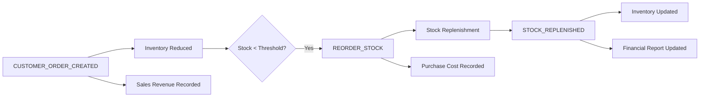

# 📦 Warehouse Management System

> A modern, event-driven warehouse management solution built with TypeScript and Node.js

## 🚀 Quick Start

Get up and running in seconds:

```bash
# Install dependencies
npm install

# Start the development server
npm run dev
```

> **⚠️ Important:** Use valid product IDs like `product-001` when testing. The application doesn't generate random inventory data.

---

## 🎯 System Overview

The Warehouse Management System is an event-driven application that demonstrates modern backend architecture patterns. It provides a command-line interface for managing inventory, processing orders, and generating financial reports.

### ⚡ Main Features

- **Order Processing** - Handle customer orders with real-time inventory updates
- **Inventory Management** - Automatic stock monitoring and reordering
- **Financial Reporting** - Dynamic profit/loss calculations
- **Event-Driven Architecture** - Decoupled services communicating via EventBus

---

## 🖥️ CLI Interface

When you run the application, you'll see:

```
🏭 Warehouse Management System
══════════════════════════════

1. 📦 Place Order
2. 📊 View Financial Report
3. 📦 View Inventory Stock Levels
4. 🏢 View Suppliers
5. 🚪 Exit

Choose an option:
```

### 🔄 Order Processing Flow

When placing an order, the system orchestrates the following sequence:

1. **Customer Input** - Collect customer ID, product ID, and quantity
2. **Order Validation** - Process through CustomerService
3. **Event Propagation** - EventBus notifies all subscribers
4. **Inventory Update** - Stock levels automatically adjusted
5. **Financial Calculation** - Revenue and costs recalculated in real-time

📋 **For detailed system flow, see [`sequence.md`](./sequence.md)** - Contains a comprehensive Mermaid diagram visualizing the complete event-driven architecture.

---

## 🧪 Example Workflow

### Sample Order Processing

```bash
> Enter Product ID: product-001
> Enter Quantity: 45
```

**Event Chain Triggered:**



---

## 📁 Project Architecture

```
warehouse-management-system/
│
├── 🏗️  core/           # Core utilities & EventBus
├── 📥  loader/         # In-memory data loaders
├── 🗄️  repository/     # Data repositories (Customer, Inventory, Orders)
├── ⚙️  services/       # Business logic services
├── 📝  types/          # TypeScript type definitions
├── 🔧  utils/          # Logging & helper utilities
└── 🎯  index.ts        # CLI application entry point
```

### 🏛️ Architecture Principles

- **Event-Driven Design** - Loose coupling via EventBus pattern
- **Domain-Driven Development** - Clear separation of business logic
- **Repository Pattern** - Abstracted data access layer
- **Service Layer** - Encapsulated business operations

---

## 💰 Financial Reporting

The system provides real-time financial insights:

```
═══════════════════════════════
        📊 Financial Report
═══════════════════════════════
💰 Total Sales:     £900.00
💸 Total Purchases: £450.00
📈 Net Income:      £450.00
═══════════════════════════════
```

> **Note:** All values are computed dynamically based on real-time events and stored state.

---

## 🛠️ Technology Stack

| Category         | Technology                          |
| ---------------- | ----------------------------------- |
| **Language**     | TypeScript                          |
| **Runtime**      | Node.js                             |
| **Architecture** | Event-Driven, Modular, OOP          |
| **Storage**      | In-Memory (Simulation)              |
| **Patterns**     | Repository, Service Layer, EventBus |

---

## 🎓 Educational Philosophy

This project embodies a strict learning approach:

> _"Don't hand over code—force deep ownership of the logic."_

### Key Learning Outcomes

- **System Thinking** - Understanding event-driven architecture
- **Code Ownership** - Building from scratch to reinforce concepts
- **Debugging Skills** - Event tracing and state management
- **Modern Patterns** - Real-world software architecture principles

---

## 👨‍💻 Development Notes

**Built from Zero:** This project was created entirely from scratch with no scaffolding or boilerplate code.

**Learning Focus:** Every class, event, and interface was deliberately crafted to strengthen understanding of:

- ✅ Real-world software architecture patterns
- ✅ Decoupled system design via event buses
- ✅ The importance of code ownership in engineering
- ✅ Modern backend development practices

---

## 📞 Support & Contributions

Found an issue or want to contribute? This project is designed for educational purposes and welcomes feedback from fellow developers learning event-driven architecture.

---

_Built with ❤️ and a commitment to deep learning_
